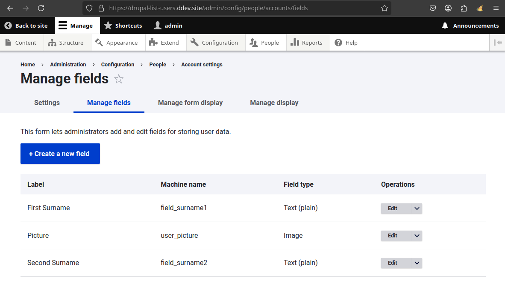
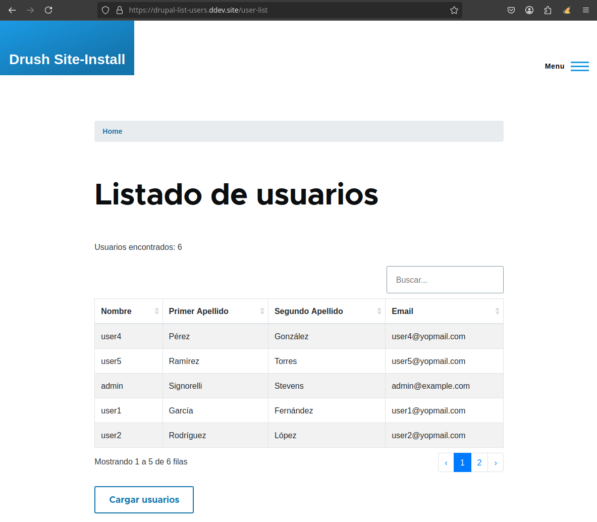
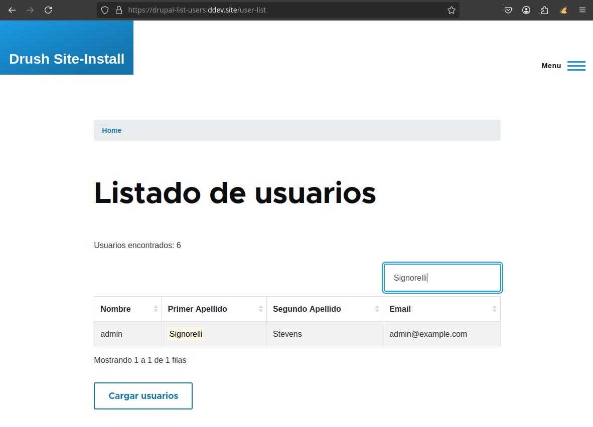
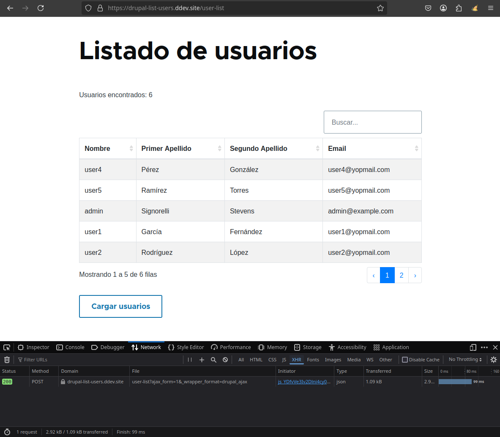

# user_list

## Requisitos

Este módulo requiere que el tipo de entidad de usuario (user's entity type) se actualice para incluir los campos Primer Apellido y Segundo Apellido. Los nombres de máquina (machine names) deben ser `field_surname1` y `field_surname2`, respectivamente.

## Instalación

1. Instalar y habilitar el módulo personalizado de Drupal `user_list`.
2. Navegar a `/user-list` para acceder al módulo.

## Características

- La lista de usuarios presenta una tabla con Bootstrap.
- La tabla permite a los usuarios filtrar fácilmente la lista mediante la caja de búsqueda.
- La tabla incluye controles de paginación para una mejor navegación.

## Descripción de Archivos

- **src/Form/UserListAjaxForm.php**: Contiene la clase de formulario que construye y maneja la funcionalidad AJAX para la lista de usuarios.
- **user_list.module**: Define el módulo y sus hooks.
- **user_list.routing.yml**: Define las rutas del módulo.
- **user_list.info.yml**: Proporciona metadatos sobre el módulo.
- **templates/user-list.html.twig**: La plantilla Twig utilizada para renderizar la tabla de la lista de usuarios.
- **js/user_list.js**: Contiene el código JavaScript para funcionalidades adicionales relacionadas con la lista de usuarios.

## Capturas de Pantalla

### Página del Módulo Lista de Usuarios

*La página `/user-list` mostrando la tabla de la lista de usuarios.*

### Filtrado con la Caja de Búsqueda

*La caja de búsqueda permite a los usuarios filtrar fácilmente la tabla de la lista de usuarios.*

### Botón Cargar Usuarios

*Al hacer clic en el botón Cargar Usuarios, se envía una nueva solicitud AJAX y se actualiza la tabla de la lista de usuarios para mostrar los usuarios recientemente agregados.*